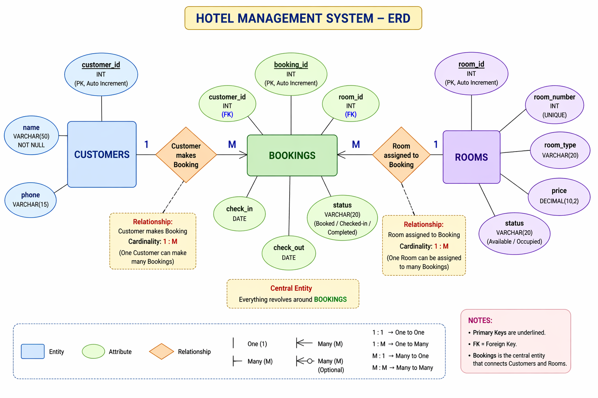

# HotelBase — Hotel Management System

- All SQL is visible in `lib/db.js` as comments
- Check ER Diagram below
- Cardinality: Customers 1:M Bookings, Rooms 1:M Bookings
- Foreign keys enforced at DB level (ON DELETE RESTRICT)
- CHECK constraint: `check_out > check_in`
- UNIQUE constraint on `room_number`


---

## Project Structure

```
hotel-mgmt/
├── index.html          → Dashboard
├── customers.html      → Customers CRUD
├── rooms.html          → Rooms CRUD
├── bookings.html       → Bookings + Check-in/out
├── erd.html            → ERD Diagram (Chen Notation)
├── styles/
│   └── main.css        → Full design system
├── lib/
│   ├── supabase.js     → Supabase client init
│   └── db.js           → ALL CRUD operations (SQL comments included)
└── pages/
    ├── dashboard.js
    ├── customers.js
    ├── rooms.js
    └── bookings.js
```

---

## Backend: Why Supabase?


Tables In Supabase:
```sql
-- Customers
CREATE TABLE customers (
  customer_id SERIAL PRIMARY KEY,
  name        VARCHAR(50) NOT NULL,
  phone       VARCHAR(15)
);

-- Rooms
CREATE TABLE rooms (
  room_id     SERIAL PRIMARY KEY,
  room_number INT UNIQUE NOT NULL,
  room_type   VARCHAR(20),
  price       DECIMAL(10, 2),
  status      VARCHAR(20) DEFAULT 'Available'
);

-- Bookings (CENTRALIZED TABLE)
CREATE TABLE bookings (
  booking_id  SERIAL PRIMARY KEY,
  customer_id INT REFERENCES customers(customer_id) ON DELETE RESTRICT,
  room_id     INT REFERENCES rooms(room_id)  ON DELETE RESTRICT,
  check_in    DATE NOT NULL,
  check_out   DATE NOT NULL,
  status      VARCHAR(20) DEFAULT 'Booked',  -- Booked / Checked-in / Completed
  CONSTRAINT chk_dates CHECK (check_out > check_in)
);

---
CREATE POLICY "allow_all_customers" 
ON customers 
FOR ALL USING (true) WITH CHECK (true);

CREATE POLICY "allow_all_rooms"     
ON rooms     
FOR ALL USING (true) WITH CHECK (true);

CREATE POLICY "allow_all_bookings"  
ON bookings  
FOR ALL USING (true) WITH CHECK (true);

```
---

## Step 4 — Deploy to Vercel

# Site is live at `---`

---

## CRUD Operations Reference

All CRUD is in `lib/db.js`. Every function has a SQL comment.

### Customers
| Operation | SQL |
|-----------|-----|
| Read All  | `SELECT * FROM customers ORDER BY customer_id DESC` |
| Search    | `SELECT * FROM customers WHERE name ILIKE '%q%'` |
| Create    | `INSERT INTO customers (name, phone) VALUES ($1, $2)` |
| Update    | `UPDATE customers SET name=$1, phone=$2 WHERE customer_id=$3` |
| Delete    | `DELETE FROM customers WHERE customer_id=$1` |

### Rooms
| Operation        | SQL |
|-----------------|-----|
| Read All         | `SELECT * FROM rooms ORDER BY room_number` |
| Read Available   | `SELECT * FROM rooms WHERE status='Available'` |
| Create           | `INSERT INTO rooms (room_number, room_type, price, status) VALUES (...)` |
| Update           | `UPDATE rooms SET ... WHERE room_id=$1` |
| Delete           | `DELETE FROM rooms WHERE room_id=$1` |

### Bookings
| Operation  | SQL |
|------------|-----|
| Read (JOIN)| `SELECT b.*, c.name, r.room_number FROM bookings b JOIN customers c ON b.customer_id=c.customer_id JOIN rooms r ON b.room_id=r.room_id` |
| Create     | `INSERT INTO bookings (...) VALUES (..., 'Booked')` |
| Check-in   | `UPDATE bookings SET status='Checked-in' WHERE booking_id=$1` |
| Check-out  | `UPDATE bookings SET status='Completed' WHERE booking_id=$1` + `UPDATE rooms SET status='Available' WHERE room_id=$1` |
| Delete     | `DELETE FROM bookings WHERE booking_id=$1` |

---

## Relationships Summary

```
CUSTOMERS (1) ──────< (M) BOOKINGS (M) >────── (1) ROOMS

One Customer can make many Bookings.
One Room can be assigned to many Bookings (over time).
Bookings is the central (junction) table.
```

---

## Tech Stack

| Layer    | Technology |
|----------|-----------|
| Frontend | Vanilla HTML + CSS + JS |
| Database | PostgreSQL via Supabase |
| API      | Supabase auto-REST (no backend code needed) |
| Hosting  | Vercel (free static hosting) |

---
